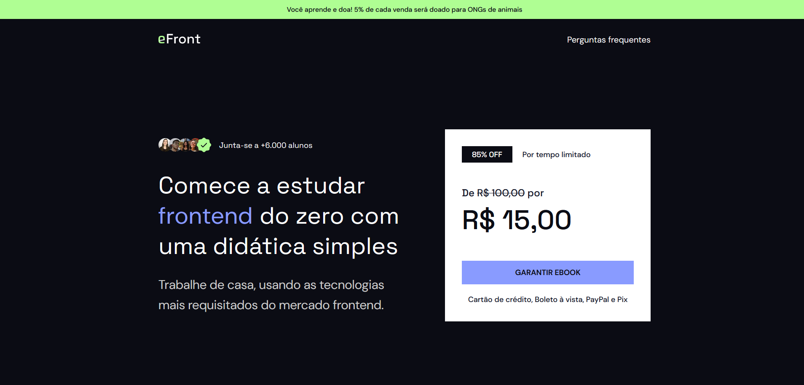

<h1 align="center">
  🛒 eFront - Iuri Silva
</h1>

<h4 align="center"><a href="https://www.iuricode.com/efront">Clique para visitar o projeto</a></h4>

## 📚 Seções

O site é composto por cinco seções:

- **Inicío:**
- **Quem sou:**
- **Tecnologias:**
- **Depoimentos:**
- **Comece agora:**

---

## 💼 Tecnologias utilizadas

Para o desenvolvimento deste site utilizei as seguintes tecnologias:

- HTML;
- Sass;
- JavaScript;

---

<h2>🦄 Autor</h2>

<table>
  <tr>
    <td align="center">
      <a href="https://github.com/iuricode">
         
        
          <b>Iuri Silva</b>
        
      </a>
    </td>
  </tr>
</table>
